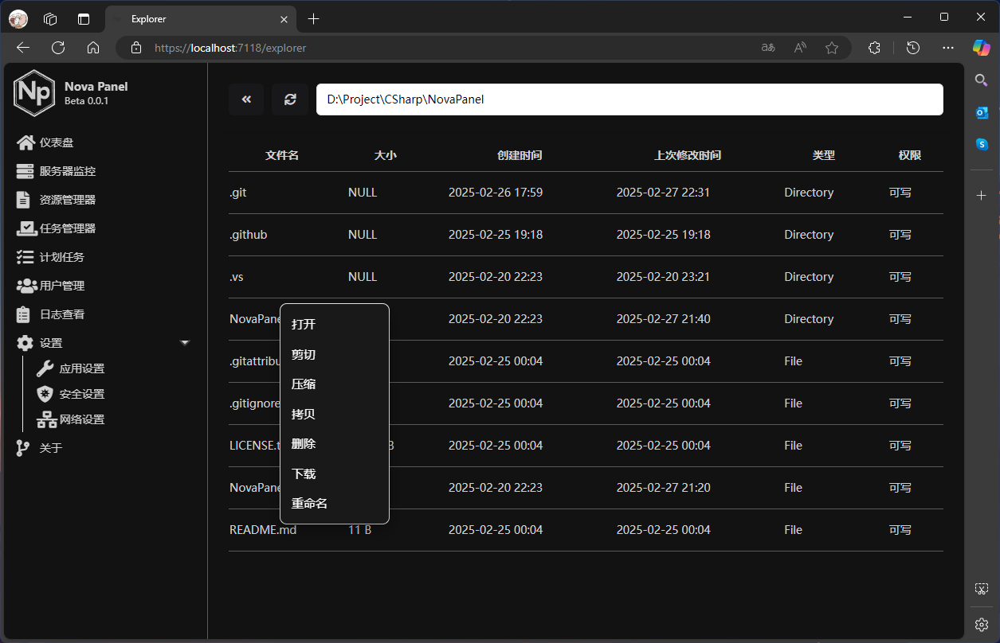
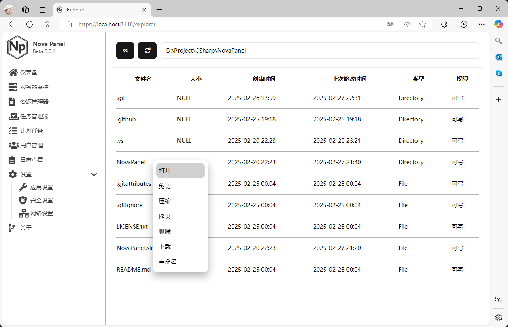

# NovaPanel - Windows Server Web 运维面板

[简体中文]
[English](english.md)
[Japanese](jp.md)

**NovaPanel** 是一款专为 Windows Server 设计的强大 Web 运维面板，旨在简化服务器管理，提高运维效率。通过仿真的任务管理器、资源管理器以及灵活的计划任务，NovaPanel 为您提供了一个直观、高效的服务器管理平台。

## Panel



## 主要特性

* **Windows Server 专属：** 专为 Windows Server 优化，提供稳定、高效的运维体验。
* **仿真任务管理器与资源管理器：** 直观的界面，实时监控服务器资源使用情况，轻松管理进程和服务。
* **灵活的计划任务：** 支持 Python、JavaScript、C#、PowerShell 脚本和 Bat 批处理，满足各种自动化需求。
* **多语言支持：** 提供多语言界面，方便全球用户使用。
* **自定义项目支持：** 支持新建 C#、网站等项目，方便快速部署和管理。
* **灵活的用户权限管理：** 精细的用户权限控制，确保服务器安全。
* **安全登录机制：** 采用安全入口 + Token 机制，保障登录流程安全。
* **域名绑定限制：** 可开启仅限绑定域名访问，增强服务器安全性。
* **防 SQL 注入：** 内置防 SQL 注入机制，有效防止恶意攻击。

## 功能亮点

* **直观的监控：** 实时查看 CPU、内存、磁盘和网络使用情况，快速定位性能瓶颈。
* **强大的自动化：** 通过计划任务实现自动化运维，提高工作效率。
* **便捷的项目管理：** 轻松创建、部署和管理各类项目，简化开发流程。
* **全面的安全防护：** 多重安全措施，确保服务器和数据安全。
* **主题定制：**
    * 通过修改 `wwwwroot\style\app.css` 来修改一些组件的样式
    * 可以通过修改 `config.json` 文件更改默认主题设置。
    * 可以使用浏览器控制台，通过执行 `document.body.classList.toggle("theme-toggle")` 命令临时切换主题。
 
      
## 快速开始

1.  **安装 .NET SDK：**
    * 安装 .NET SDK 8.0 或 9.0 或更高版本。
    * 您可以在 `NovaPanel/NovaPanel.csproj` 文件中更改 .NET SDK 版本。
2.  **克隆源代码：**
    * 使用 Git 克隆 NovaPanel 源代码：
        ```bash
        git clone https://github.com/NovaConnect/NovaPanel.git
        ```
3.  **进入项目目录：**
    * 打开终端，导航到 NovaPanel 项目目录：
        ```bash
        cd NovaPanel/NovaPanel
        ```
4.  **运行软件：**
    * 使用 .NET CLI 运行 NovaPanel：
        ```bash
        dotnet run
        ```

## 使用说明

* **仪表盘：** 查看服务器资源使用情况和系统信息。
* **任务管理器：** 管理进程和服务，结束或重启进程。
* **资源管理器：** 管理文件和文件夹，上传、下载、删除文件。
* **计划任务：** 创建和管理计划任务，实现自动化运维。
* **项目管理：** 创建和管理项目，部署网站和应用。
* **用户管理：** 管理用户和权限，分配角色。
* **安全设置：** 配置安全选项，设置域名绑定和安全入口。
* **主题设置：** 通过 `config.json` 或浏览器控制台更改主题。
  
## 贡献

欢迎贡献代码、提出建议或报告问题。请通过 GitHub Issues 或 Pull Requests 参与项目。

## 联系方式

如果您有任何问题或建议，请通过以下方式联系我们：

* 我的工作邮箱：[Sm4Z0n3Mua@gmail.com]
* GitHub：[NovaConnect社区](https://github.com/NovaConnect)

## 鸣谢
* **第三方库支持：**
    * 使用 `Blazor.ContextMenu` 提供右键菜单功能。
    * 使用 `Shadcn/UI` 提供美观、现代的用户界面。
    * 感谢所有为本项目做出贡献的开发者和用户。

